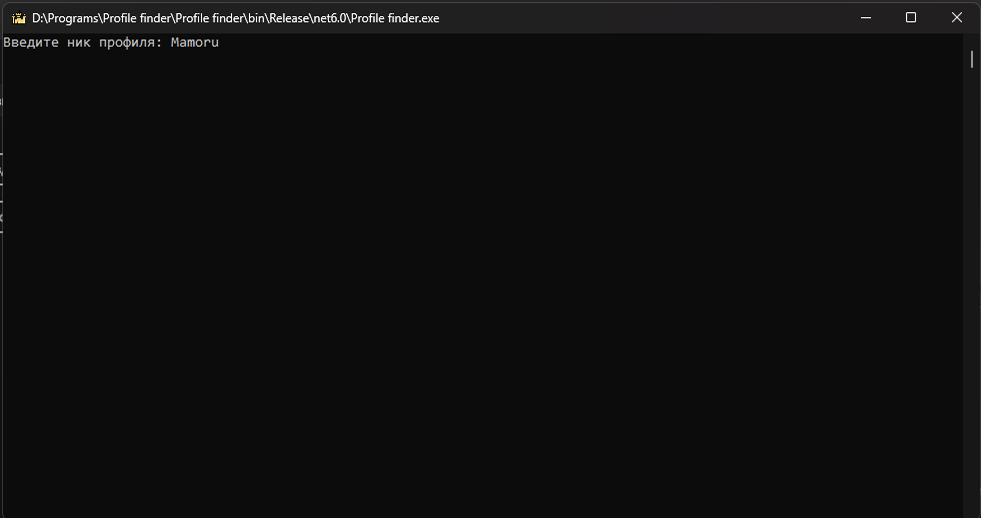

# Profile finder

Данная программа предназначена для поиска профиля посредством ввода ника в открытой коммандной строке.

Видео инструкция
=======
ПОКА ЧТО ВИДЕО НЕ СДЕЛАЛ.

Текстовая инструкция
=======
Что бы скачать программу, вам нужно справа нажать на Release. На странице загрузки нужно скачать файл Profile.finder.rar

1. Распаковываем архив в любое место.

2. Главное условие - вам нужно активировать "Эмуляция отключена" в Bv Gamer Tools. Это нужно для того, что бы папки профилей отображались корректно.

3. Запускаем Profile finder.exe
4. Вписать ник (Без пробелов и правильно), так же можно просто скопировать ник с рабочей таблицы и вставить в консоль.

5. Нажать Enter.

После чего у вас откроется папка с профилем, который вам нужен. Вы можете в адресной строке нажать на папку BV Gamer Tools и перети в эту папку.

В этой папке будет подсвечиватся нужный вам профиль и, если с этим профилем проблеммы, удалить его.

